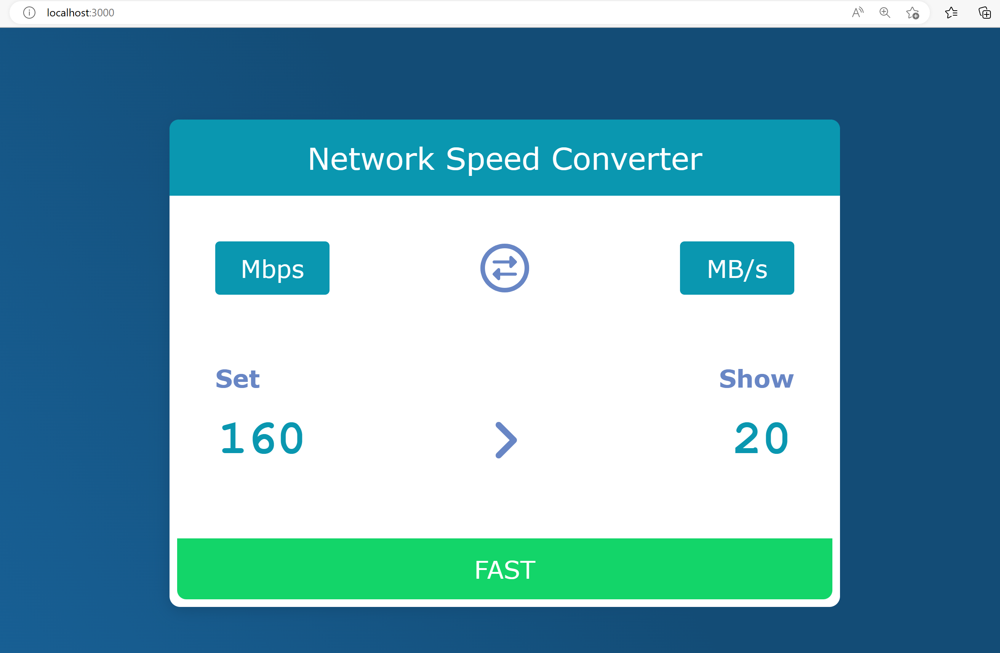

# react-from-hooks

## reference
[learn-react-from-hooks-internet-speed-converter](https://github.com/pjchender/learn-react-from-hooks-internet-speed-converter)

## GitHub Page
[https://charleswang007.github.io/react-from-hooks/](https://charleswang007.github.io/react-from-hooks/)

## result

